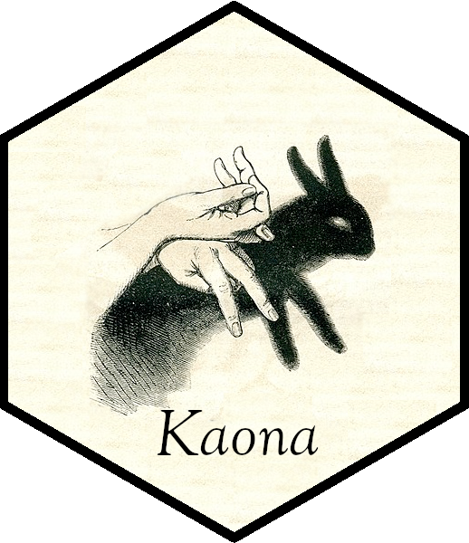

# Kaona <a href="https://github.com/sailuh/kaona"></a>

Kaona means in Hawaiian, "hidden meaning," as in poetry. "Nani ke kaona o ke mele", translated, "Beautiful is the hidden meaning in this song."

This package implements text mining methods to aid in the exploration of text data and grouping of records. Examples are provided in the context of the [NASA Aviation Safety Reporting System (ASRS)](https://asrs.arc.nasa.gov) narratives, however the methods found here can be reused in other domains.

## Getting started

To get started, please see the [Online ASRS Record Query Formatting](http://itm0.shidler.hawaii.edu/kaona/articles/parsing_asrs_records.html) vignette to understand how to parse ASRS data.

## How to cite Kaona 

If you are using Kaona in your research, please cite any of the following works: 

```
@inbook{doi:10.2514/6.2021-2404,
author = {Carlos V. Paradis and Rick Kazman and Misty D. Davies and Becky L. Hooey},
title = {A Survey Protocol to Assess Meaningfulness and Usefulness of Automated Topic Finding in the NASA Aviation Safety Reporting System},
booktitle = {AIAA AVIATION 2021 FORUM},
chapter = {},
pages = {},
doi = {10.2514/6.2021-2404},
URL = {https://arc.aiaa.org/doi/abs/10.2514/6.2021-2404},
eprint = {https://arc.aiaa.org/doi/pdf/10.2514/6.2021-2404}}


@inbook{doi:10.2514/6.2021-1981,
author = {Carlos Paradis and Rick Kazman and Misty Davies and Becky Hooey},
title = {Augmenting Topic Finding in the NASA Aviation Safety Reporting System using Topic Modeling},
booktitle = {AIAA Scitech 2021 Forum},
chapter = {},
pages = {},
doi = {10.2514/6.2021-1981},
URL = {https://arc.aiaa.org/doi/abs/10.2514/6.2021-1981},
eprint = {https://arc.aiaa.org/doi/pdf/10.2514/6.2021-1981}
}
```
